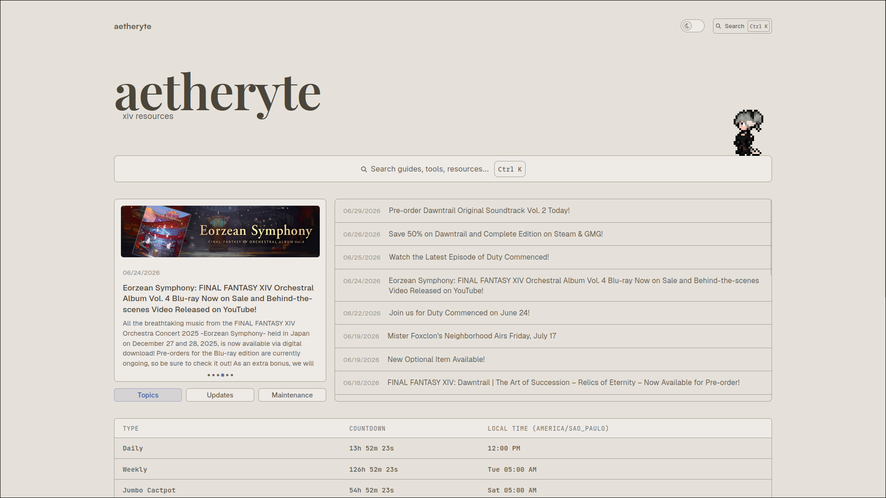

# aetheryte

This is aetheryte. A FINAL FANTASY XIV resources & tools website. It solves the common pain of players, mostly raiders, having to find the right resources to beat content.

I used a simple React + VITE stack. This project was fun for learning new tools.

With the much simpler mdx, we can write guides easily.

> Why aetheryte? Because it gets you to places quickly!

## Features

-**Duty guides**: All the latest relevant duty guides and resources needed to beat the current expansion's or ageless content.

-**Waymark builder**: Drag-and-drop waymark editor with support for multiple arena sizes.

-**Lodestone news**: Live feed of topics, updates, and maintenance.

-**Reset timers**: Daily, weekly, and other FFXIV reset countdowns, always in your own timezone.

## Contributing

Feel free to contribute if you have suggestions, or think you could add new content, or improve something already existing in the codebase!

I am also open for contributors to make their own guides and post here, as long as it follows the site's style and formatting! If possible, check a few of the guides and how they're laid out before writing one.

See [CONTRIBUTING.md](./CONTRIBUTING.md)

## XIVDoc

I have actually attempted to make something like this before, and had called it "XIVDoc". But about a year after abandoning the project, due to how difficult it was to maintain, I wanted to remake and rebrand it properly, after learning new things! You can still check what the old website used to look like: [xivdoc](https://vittv.github.io/xivdoc/).

## License

MIT
